# Nation States Tech Tree

```mermaid
flowchart LR
    5G_Networks["5G Networks"]
    Advanced_Composites["Advanced Composites"]
    Advanced_Flight["Advanced Flight"]
    Advanced_Naval_Warfare["Advanced Naval Warfare"]
    Advanced_Renewable_Energy["Advanced Renewable Energy"]
    Aerodynamics["Aerodynamics"]
    Aerospace_Engineering["Aerospace Engineering"]
    Agricultural_Chemistry["Agricultural Chemistry"]
    Alphabet["Alphabet"]
    Amphibious_Warfare["Amphibious Warfare"]
    Anesthesia["Anesthesia"]
    Antibiotics["Antibiotics"]
    Antiseptics["Antiseptics"]
    Armor_Plate["Armor Plate"]
    Artificial_Intelligence["Artificial Intelligence"]
    Assembly_Line["Assembly Line"]
    Astronomy["Astronomy"]
    Atomic_Theory["Atomic Theory"]
    Automation["Automation"]
    Automobile["Automobile"]
    Autonomous_Weapons["Autonomous Weapons"]
    Aviation_Industry["Aviation Industry"]
    Ballistic_Missile_Defense["Ballistic Missile Defense"]
    Ballistics["Ballistics"]
    Banking["Banking"]
    Biotechnology["Biotechnology"]
    Bridge_Building["Bridge Building"]
    Bronze_Working["Bronze Working"]
    Cell_Biology["Cell Biology"]
    Ceremonial_Burial["Ceremonial Burial"]
    Chemical_Warfare["Chemical Warfare"]
    Chemistry["Chemistry"]
    Chivalry["Chivalry"]
    Cinema["Cinema"]
    Civil_Aviation["Civil Aviation"]
    Civil_Service["Civil Service"]
    Code_of_Laws["Code of Laws"]
    Cold_War_Doctrine["Cold War Doctrine"]
    Combined_Arms["Combined Arms"]
    Combustion["Combustion"]
    Communism["Communism"]
    Computers["Computers"]
    Conscription["Conscription"]
    Construction["Construction"]
    Containerization["Containerization"]
    Containment["Containment"]
    Counterinsurgency["Counterinsurgency"]
    Cruise_Missile_Technology["Cruise Missile Technology"]
    Cryogenics["Cryogenics"]
    Cryptography["Cryptography"]
    Currency["Currency"]
    Cyber_Warfare["Cyber Warfare"]
    Decolonization["Decolonization"]
    Democracy["Democracy"]
    Desalination["Desalination"]
    Digital_Electronics["Digital Electronics"]
    Directed_Energy_Weapons["Directed Energy Weapons"]
    Dreadnought["Dreadnought"]
    Drones["Drones"]
    Ecology["Ecology"]
    Economics["Economics"]
    Electrical_Engineering["Electrical Engineering"]
    Electricity["Electricity"]
    Electrification["Electrification"]
    Electromagnetism["Electromagnetism"]
    Electronics["Electronics"]
    Engineering["Engineering"]
    Environmentalism["Environmentalism"]
    Epidemiology["Epidemiology"]
    Espionage["Espionage"]
    Explosives["Explosives"]
    Fascism["Fascism"]
    Fertilizers["Fertilizers"]
    Feudalism["Feudalism"]
    Fiber_Optics["Fiber Optics"]
    Flight["Flight"]
    Food_Preservation["Food Preservation"]
    Fusion_Power["Fusion Power"]
    GPS["GPS"]
    Genetic_Engineering["Genetic Engineering"]
    Genetic_Modification["Genetic Modification"]
    Genomics["Genomics"]
    Globalization["Globalization"]
    Green_Revolution["Green Revolution"]
    Guerilla_Warfare["Guerilla Warfare"]
    Guided_Missiles["Guided Missiles"]
    Gunpowder["Gunpowder"]
    Helicopters["Helicopters"]
    Horseback_Riding["Horseback Riding"]
    Hypersonic_Weapons["Hypersonic Weapons"]
    ICBM["ICBM"]
    Industrialization["Industrialization"]
    Information_Warfare["Information Warfare"]
    Integrated_Circuits["Integrated Circuits"]
    International_Law["International Law"]
    Internet["Internet"]
    Invention["Invention"]
    Iron_Working["Iron Working"]
    Jet_Aviation["Jet Aviation"]
    Jet_Propulsion["Jet Propulsion"]
    Journalism["Journalism"]
    Labor_Movement["Labor Movement"]
    Labor_Union["Labor Union"]
    Laser["Laser"]
    Leadership["Leadership"]
    Literacy["Literacy"]
    Logistics["Logistics"]
    Machine_Tools["Machine Tools"]
    Magnetism["Magnetism"]
    Map_Making["Map Making"]
    Masonry["Masonry"]
    Mass_Production["Mass Production"]
    Materials_Science["Materials Science"]
    Mathematics["Mathematics"]
    Mechanized_Agriculture["Mechanized Agriculture"]
    Medicine["Medicine"]
    Metallurgical_Science["Metallurgical Science"]
    Metallurgy["Metallurgy"]
    Microbiology["Microbiology"]
    Microprocessor["Microprocessor"]
    Military_Aviation["Military Aviation"]
    Mine_Warfare["Mine Warfare"]
    Miniaturization["Miniaturization"]
    Mobile_Telephony["Mobile Telephony"]
    Mobile_Warfare["Mobile Warfare"]
    Modern_Artillery["Modern Artillery"]
    Molecular_Biology["Molecular Biology"]
    Monarchy["Monarchy"]
    Monotheism["Monotheism"]
    Motorized_Transport["Motorized Transport"]
    Mysticism["Mysticism"]
    Nanotechnology["Nanotechnology"]
    Nationalism["Nationalism"]
    Naval_Aviation["Naval Aviation"]
    Navigation["Navigation"]
    Nuclear_Fission["Nuclear Fission"]
    Nuclear_Power["Nuclear Power"]
    Nuclear_Strategy["Nuclear Strategy"]
    Nuclear_Submarine["Nuclear Submarine"]
    Nuclear_Weapons["Nuclear Weapons"]
    Optics["Optics"]
    Optoelectronics["Optoelectronics"]
    Organic_Chemistry["Organic Chemistry"]
    Paratrooper_Doctrine["Paratrooper Doctrine"]
    Personal_Computers["Personal Computers"]
    Petrochemical_Industry["Petrochemical Industry"]
    Petrochemicals["Petrochemicals"]
    Petroleum_Industry["Petroleum Industry"]
    Pharmaceutical_Industry["Pharmaceutical Industry"]
    Philosophy["Philosophy"]
    Photography["Photography"]
    Physics["Physics"]
    Plasma_Physics["Plasma Physics"]
    Plastics["Plastics"]
    Plastics_Industry["Plastics Industry"]
    Polytheism["Polytheism"]
    Pottery["Pottery"]
    Precision_Manufacturing["Precision Manufacturing"]
    Propaganda["Propaganda"]
    Public_Education["Public Education"]
    Public_Health["Public Health"]
    Quantum_Computing["Quantum Computing"]
    Quantum_Theory["Quantum Theory"]
    Radar["Radar"]
    Radio["Radio"]
    Railroad["Railroad"]
    Recycling["Recycling"]
    Refining["Refining"]
    Refrigeration["Refrigeration"]
    Reinforced_Concrete["Reinforced Concrete"]
    Renewable_Energy["Renewable Energy"]
    Rifling["Rifling"]
    Robotics["Robotics"]
    Rocketry["Rocketry"]
    Rubber_Processing["Rubber Processing"]
    Sanitation["Sanitation"]
    Satellites["Satellites"]
    Seafaring["Seafaring"]
    Selective_Breeding["Selective Breeding"]
    Semiconductor["Semiconductor"]
    Smart_Weapons["Smart Weapons"]
    Social_Media["Social Media"]
    Socialism["Socialism"]
    Sonar["Sonar"]
    Space_Commercialization["Space Commercialization"]
    Space_Flight["Space Flight"]
    Space_Station["Space Station"]
    Stealth["Stealth"]
    Steam_Engine["Steam Engine"]
    Steam_Turbine["Steam Turbine"]
    Steel["Steel"]
    Strategic_Bombing["Strategic Bombing"]
    Submarine_Warfare["Submarine Warfare"]
    Suburban_Development["Suburban Development"]
    Suffrage["Suffrage"]
    Superconductors["Superconductors"]
    Surgery["Surgery"]
    Synthetic_Materials["Synthetic Materials"]
    Tactics["Tactics"]
    Telecommunications["Telecommunications"]
    Telegraph["Telegraph"]
    Telephone["Telephone"]
    Television["Television"]
    Television_Broadcasting["Television Broadcasting"]
    The_Corporation["The Corporation"]
    The_Republic["The Republic"]
    The_Wheel["The Wheel"]
    Theology["Theology"]
    Theory_of_Gravity["Theory of Gravity"]
    Thermodynamics["Thermodynamics"]
    Torpedo["Torpedo"]
    Total_War_Doctrine["Total War Doctrine"]
    Trade["Trade"]
    Transistors["Transistors"]
    Trench_Warfare["Trench Warfare"]
    Tropical_Medicine["Tropical Medicine"]
    Turbofan["Turbofan"]
    United_Nations["United Nations"]
    University["University"]
    Unmanned_Vehicles["Unmanned Vehicles"]
    Vaccination["Vaccination"]
    War_Economy["War Economy"]
    Warrior_Code["Warrior Code"]
    Writing["Writing"]

    Mobile_Telephony --> 5G_Networks
    Fiber_Optics --> 5G_Networks
    Materials_Science --> Advanced_Composites
    Plastics --> Advanced_Composites
    Radio --> Advanced_Flight
    Machine_Tools --> Advanced_Flight
    Naval_Aviation --> Advanced_Naval_Warfare
    Sonar --> Advanced_Naval_Warfare
    Renewable_Energy --> Advanced_Renewable_Energy
    Superconductors --> Advanced_Renewable_Energy
    Physics --> Aerodynamics
    Mathematics --> Aerodynamics
    Space_Flight --> Aerospace_Engineering
    Jet_Aviation --> Aerospace_Engineering
    Chemistry --> Agricultural_Chemistry
    Trade --> Agricultural_Chemistry
    Engineering --> Amphibious_Warfare
    Tactics --> Amphibious_Warfare
    Medicine --> Anesthesia
    Organic_Chemistry --> Anesthesia
    Epidemiology --> Antibiotics
    Organic_Chemistry --> Antibiotics
    Microbiology --> Antiseptics
    Organic_Chemistry --> Antiseptics
    Metallurgical_Science --> Armor_Plate
    Navigation --> Armor_Plate
    Internet --> Artificial_Intelligence
    Robotics --> Artificial_Intelligence
    Mass_Production --> Assembly_Line
    Electrical_Engineering --> Assembly_Line
    Mysticism --> Astronomy
    Mathematics --> Astronomy
    Chemistry --> Atomic_Theory
    Physics --> Atomic_Theory
    Computers --> Automation
    Mass_Production --> Automation
    Combustion --> Automobile
    Steel --> Automobile
    Drones --> Autonomous_Weapons
    Artificial_Intelligence --> Autonomous_Weapons
    Flight --> Aviation_Industry
    Mass_Production --> Aviation_Industry
    Nuclear_Strategy --> Ballistic_Missile_Defense
    Satellites --> Ballistic_Missile_Defense
    Explosives --> Ballistics
    Mathematics --> Ballistics
    Trade --> Banking
    The_Republic --> Banking
    Molecular_Biology --> Biotechnology
    Computers --> Biotechnology
    The_Wheel --> Bridge_Building
    Construction --> Bridge_Building
    Biotechnology --> Cell_Biology
    Surgery --> Cell_Biology
    Trench_Warfare --> Chemical_Warfare
    Organic_Chemistry --> Chemical_Warfare
    University --> Chemistry
    Medicine --> Chemistry
    Feudalism --> Chivalry
    Horseback_Riding --> Chivalry
    Photography --> Cinema
    Electrification --> Cinema
    Turbofan --> Civil_Aviation
    Radar --> Civil_Aviation
    Democracy --> Civil_Service
    Literacy --> Civil_Service
    Alphabet --> Code_of_Laws
    Nuclear_Weapons --> Cold_War_Doctrine
    Espionage --> Cold_War_Doctrine
    Mobile_Warfare --> Combined_Arms
    Advanced_Flight --> Combined_Arms
    Refining --> Combustion
    Thermodynamics --> Combustion
    Theology --> Communism
    Industrialization --> Communism
    Electronics --> Computers
    Cryptography --> Computers
    Democracy --> Conscription
    Metallurgy --> Conscription
    Masonry --> Construction
    Iron_Working --> Construction
    Logistics --> Containerization
    Automation --> Containerization
    Cold_War_Doctrine --> Containment
    Propaganda --> Containment
    Guerilla_Warfare --> Counterinsurgency
    Helicopters --> Counterinsurgency
    Smart_Weapons --> Cruise_Missile_Technology
    Jet_Aviation --> Cruise_Missile_Technology
    Thermodynamics --> Cryogenics
    Quantum_Theory --> Cryogenics
    Mathematics --> Cryptography
    Radio --> Cryptography
    Bronze_Working --> Currency
    Information_Warfare --> Cyber_Warfare
    Cryptography --> Cyber_Warfare
    International_Law --> Decolonization
    Nationalism --> Decolonization
    Banking --> Democracy
    Invention --> Democracy
    Nuclear_Power --> Desalination
    Ecology --> Desalination
    Microprocessor --> Digital_Electronics
    Fiber_Optics --> Digital_Electronics
    Laser --> Directed_Energy_Weapons
    Advanced_Composites --> Directed_Energy_Weapons
    Armor_Plate --> Dreadnought
    Steam_Turbine --> Dreadnought
    Unmanned_Vehicles --> Drones
    Smart_Weapons --> Drones
    Pharmaceutical_Industry --> Ecology
    Public_Health --> Ecology
    Banking --> Economics
    University --> Economics
    Electromagnetism --> Electrical_Engineering
    Engineering --> Electrical_Engineering
    Metallurgy --> Electricity
    Theory_of_Gravity --> Electricity
    Electrical_Engineering --> Electrification
    Industrialization --> Electrification
    Electricity --> Electromagnetism
    Theory_of_Gravity --> Electromagnetism
    The_Corporation --> Electronics
    Electricity --> Electronics
    Electricity --> Engineering
    Steam_Engine --> Engineering
    Ecology --> Environmentalism
    Space_Flight --> Environmentalism
    Public_Health --> Epidemiology
    Mathematics --> Epidemiology
    Communism --> Espionage
    Democracy --> Espionage
    Gunpowder --> Explosives
    Chemistry --> Explosives
    Nationalism --> Fascism
    Propaganda --> Fascism
    Agricultural_Chemistry --> Fertilizers
    Industrialization --> Fertilizers
    Iron_Working --> Feudalism
    Monarchy --> Feudalism
    Optoelectronics --> Fiber_Optics
    Telecommunications --> Fiber_Optics
    Combustion --> Flight
    Aerodynamics --> Flight
    Chemistry --> Food_Preservation
    Trade --> Food_Preservation
    Superconductors --> Fusion_Power
    Plasma_Physics --> Fusion_Power
    Satellites --> GPS
    Microprocessor --> GPS
    Molecular_Biology --> Genetic_Engineering
    Computers --> Genetic_Engineering
    Genetic_Engineering --> Genetic_Modification
    Biotechnology --> Genetic_Modification
    Genetic_Modification --> Genomics
    Personal_Computers --> Genomics
    Internet --> Globalization
    Containerization --> Globalization
    Fertilizers --> Green_Revolution
    Selective_Breeding --> Green_Revolution
    Nationalism --> Guerilla_Warfare
    Tactics --> Guerilla_Warfare
    Ballistics --> Guided_Missiles
    Radar --> Guided_Missiles
    Invention --> Gunpowder
    Feudalism --> Gunpowder
    Advanced_Flight --> Helicopters
    Combustion --> Helicopters
    Jet_Propulsion --> Hypersonic_Weapons
    Advanced_Composites --> Hypersonic_Weapons
    Guided_Missiles --> ICBM
    Nuclear_Weapons --> ICBM
    Steam_Engine --> Industrialization
    Banking --> Industrialization
    Internet --> Information_Warfare
    Espionage --> Information_Warfare
    Semiconductor --> Integrated_Circuits
    Miniaturization --> Integrated_Circuits
    Democracy --> International_Law
    Telegraph --> International_Law
    Fiber_Optics --> Internet
    Personal_Computers --> Internet
    Bridge_Building --> Invention
    Literacy --> Invention
    Bronze_Working --> Iron_Working
    Warrior_Code --> Iron_Working
    Jet_Propulsion --> Jet_Aviation
    Military_Aviation --> Jet_Aviation
    Aerodynamics --> Jet_Propulsion
    Combustion --> Jet_Propulsion
    Literacy --> Journalism
    Telegraph --> Journalism
    Socialism --> Labor_Movement
    Industrialization --> Labor_Movement
    Labor_Movement --> Labor_Union
    Industrialization --> Labor_Union
    Quantum_Theory --> Laser
    Semiconductor --> Laser
    Chivalry --> Leadership
    Gunpowder --> Leadership
    Writing --> Literacy
    Code_of_Laws --> Literacy
    Railroad --> Logistics
    Tactics --> Logistics
    Metallurgy --> Machine_Tools
    Tactics --> Machine_Tools
    Seafaring --> Magnetism
    Astronomy --> Magnetism
    Alphabet --> Map_Making
    Automobile --> Mass_Production
    The_Corporation --> Mass_Production
    Organic_Chemistry --> Materials_Science
    Steel --> Materials_Science
    Alphabet --> Mathematics
    Masonry --> Mathematics
    Combustion --> Mechanized_Agriculture
    Agricultural_Chemistry --> Mechanized_Agriculture
    Philosophy --> Medicine
    Trade --> Medicine
    Metallurgy --> Metallurgical_Science
    Thermodynamics --> Metallurgical_Science
    Gunpowder --> Metallurgy
    Mathematics --> Metallurgy
    Optics --> Microbiology
    Medicine --> Microbiology
    Integrated_Circuits --> Microprocessor
    Computers --> Microprocessor
    Flight --> Military_Aviation
    Machine_Tools --> Military_Aviation
    Torpedo --> Mine_Warfare
    Explosives --> Mine_Warfare
    Electronics --> Miniaturization
    Precision_Manufacturing --> Miniaturization
    Personal_Computers --> Mobile_Telephony
    Telecommunications --> Mobile_Telephony
    Automobile --> Mobile_Warfare
    Machine_Tools --> Mobile_Warfare
    Ballistics --> Modern_Artillery
    Steel --> Modern_Artillery
    Microbiology --> Molecular_Biology
    Quantum_Theory --> Molecular_Biology
    Ceremonial_Burial --> Monarchy
    Code_of_Laws --> Monarchy
    Astronomy --> Monotheism
    Polytheism --> Monotheism
    Automobile --> Motorized_Transport
    Logistics --> Motorized_Transport
    Ceremonial_Burial --> Mysticism
    Molecular_Biology --> Nanotechnology
    Advanced_Composites --> Nanotechnology
    Philosophy --> Nationalism
    Literacy --> Nationalism
    Military_Aviation --> Naval_Aviation
    Dreadnought --> Naval_Aviation
    Invention --> Navigation
    Physics --> Navigation
    Quantum_Theory --> Nuclear_Fission
    Mass_Production --> Nuclear_Fission
    Nuclear_Fission --> Nuclear_Power
    Electronics --> Nuclear_Power
    ICBM --> Nuclear_Strategy
    Cold_War_Doctrine --> Nuclear_Strategy
    Nuclear_Power --> Nuclear_Submarine
    Submarine_Warfare --> Nuclear_Submarine
    Nuclear_Fission --> Nuclear_Weapons
    Rocketry --> Nuclear_Weapons
    Physics --> Optics
    Mathematics --> Optics
    Laser --> Optoelectronics
    Semiconductor --> Optoelectronics
    Chemistry --> Organic_Chemistry
    Thermodynamics --> Organic_Chemistry
    Advanced_Flight --> Paratrooper_Doctrine
    Trench_Warfare --> Paratrooper_Doctrine
    Microprocessor --> Personal_Computers
    Television_Broadcasting --> Personal_Computers
    Petrochemicals --> Petrochemical_Industry
    Mass_Production --> Petrochemical_Industry
    Petroleum_Industry --> Petrochemicals
    Organic_Chemistry --> Petrochemicals
    Refining --> Petroleum_Industry
    The_Corporation --> Petroleum_Industry
    Antibiotics --> Pharmaceutical_Industry
    Mass_Production --> Pharmaceutical_Industry
    Mysticism --> Philosophy
    Literacy --> Philosophy
    Optics --> Photography
    Chemistry --> Photography
    The_Wheel --> Physics
    Magnetism --> Physics
    Nuclear_Power --> Plasma_Physics
    Quantum_Theory --> Plasma_Physics
    Organic_Chemistry --> Plastics
    Industrialization --> Plastics
    Plastics --> Plastics_Industry
    Petrochemical_Industry --> Plastics_Industry
    Horseback_Riding --> Polytheism
    Ceremonial_Burial --> Polytheism
    Machine_Tools --> Precision_Manufacturing
    Industrialization --> Precision_Manufacturing
    Cinema --> Propaganda
    Journalism --> Propaganda
    Civil_Service --> Public_Education
    University --> Public_Education
    Vaccination --> Public_Health
    Medicine --> Public_Health
    Artificial_Intelligence --> Quantum_Computing
    Quantum_Theory --> Quantum_Computing
    Atomic_Theory --> Quantum_Theory
    Electromagnetism --> Quantum_Theory
    Radio --> Radar
    Electrical_Engineering --> Radar
    Flight --> Radio
    Electrical_Engineering --> Radio
    Steam_Engine --> Railroad
    Metallurgy --> Railroad
    Plastics --> Recycling
    Ecology --> Recycling
    Chemistry --> Refining
    Industrialization --> Refining
    Chemistry --> Refrigeration
    Electricity --> Refrigeration
    Steel --> Reinforced_Concrete
    Construction --> Reinforced_Concrete
    Ecology --> Renewable_Energy
    Electrical_Engineering --> Renewable_Energy
    Metallurgy --> Rifling
    Ballistics --> Rifling
    Computers --> Robotics
    Automation --> Robotics
    Jet_Propulsion --> Rocketry
    Guided_Missiles --> Rocketry
    Chemistry --> Rubber_Processing
    Trade --> Rubber_Processing
    Bridge_Building --> Sanitation
    Medicine --> Sanitation
    Space_Flight --> Satellites
    Radar --> Satellites
    Pottery --> Seafaring
    Map_Making --> Seafaring
    Agricultural_Chemistry --> Selective_Breeding
    Medicine --> Selective_Breeding
    Transistors --> Semiconductor
    Materials_Science --> Semiconductor
    GPS --> Smart_Weapons
    Guided_Missiles --> Smart_Weapons
    Internet --> Social_Media
    Mobile_Telephony --> Social_Media
    Economics --> Socialism
    Nationalism --> Socialism
    Submarine_Warfare --> Sonar
    Electromagnetism --> Sonar
    Space_Station --> Space_Commercialization
    The_Corporation --> Space_Commercialization
    Computers --> Space_Flight
    Rocketry --> Space_Flight
    Aerospace_Engineering --> Space_Station
    Space_Flight --> Space_Station
    Advanced_Composites --> Stealth
    Radar --> Stealth
    Chemistry --> Steam_Engine
    Navigation --> Steam_Engine
    Thermodynamics --> Steam_Turbine
    Steel --> Steam_Turbine
    Railroad --> Steel
    Industrialization --> Steel
    Aviation_Industry --> Strategic_Bombing
    Military_Aviation --> Strategic_Bombing
    Torpedo --> Submarine_Warfare
    Steel --> Submarine_Warfare
    Automobile --> Suburban_Development
    Reinforced_Concrete --> Suburban_Development
    Democracy --> Suffrage
    Public_Education --> Suffrage
    Laser --> Superconductors
    Cryogenics --> Superconductors
    Anesthesia --> Surgery
    Antiseptics --> Surgery
    Organic_Chemistry --> Synthetic_Materials
    Industrialization --> Synthetic_Materials
    Conscription --> Tactics
    Leadership --> Tactics
    Television --> Telecommunications
    Telephone --> Telecommunications
    Electricity --> Telegraph
    Railroad --> Telegraph
    Telegraph --> Telephone
    Electromagnetism --> Telephone
    Radio --> Television
    Electronics --> Television
    Television --> Television_Broadcasting
    Telecommunications --> Television_Broadcasting
    Economics --> The_Corporation
    Industrialization --> The_Corporation
    Code_of_Laws --> The_Republic
    Literacy --> The_Republic
    Horseback_Riding --> The_Wheel
    Philosophy --> Theology
    Monotheism --> Theology
    Physics --> Theory_of_Gravity
    University --> Theory_of_Gravity
    Physics --> Thermodynamics
    Chemistry --> Thermodynamics
    Explosives --> Torpedo
    Steam_Engine --> Torpedo
    War_Economy --> Total_War_Doctrine
    Fascism --> Total_War_Doctrine
    Currency --> Trade
    Pottery --> Trade
    Electronics --> Transistors
    Quantum_Theory --> Transistors
    Modern_Artillery --> Trench_Warfare
    Conscription --> Trench_Warfare
    Epidemiology --> Tropical_Medicine
    Microbiology --> Tropical_Medicine
    Jet_Propulsion --> Turbofan
    Thermodynamics --> Turbofan
    International_Law --> United_Nations
    Suffrage --> United_Nations
    Mathematics --> University
    Philosophy --> University
    Robotics --> Unmanned_Vehicles
    GPS --> Unmanned_Vehicles
    Medicine --> Vaccination
    Chemistry --> Vaccination
    Assembly_Line --> War_Economy
    Conscription --> War_Economy
    Alphabet --> Writing
```

## Technology Reference

| Technology | Requires | Enables | Year | Wikipedia |
|---|---|---|---|---|
| Code of Laws | Alphabet | Courthouse (bldg) | 1754 BC | [Link](https://en.wikipedia.org/wiki/Code_of_Hammurabi) |
| Literacy | Writing, Code of Laws | Great Library (bldg) | 1050 BC | [Link](https://en.wikipedia.org/wiki/Phoenician_alphabet) |
| Philosophy | Mysticism, Literacy |  | 600 BC | [Link](https://en.wikipedia.org/wiki/Ancient_Greek_philosophy) |
| The Republic | Code of Laws, Literacy |  | 509 BC | [Link](https://en.wikipedia.org/wiki/Roman_Republic) |
| Mathematics | Alphabet, Masonry | Catapult (unit) | 300 BC | [Link](https://en.wikipedia.org/wiki/Euclid%27s_Elements) |
| Feudalism | Iron Working, Monarchy | Pikemen (unit), Sun Tzu's War Academy (bldg) | 1000 | [Link](https://en.wikipedia.org/wiki/Feudalism) |
| Horseback Riding |  | Horsemen (unit) | 1000 | [Link](https://en.wikipedia.org/wiki/Equestrianism) |
| Monarchy | Ceremonial Burial, Code of Laws |  | 1000 | [Link](https://en.wikipedia.org/wiki/Monarchy) |
| Warrior Code |  | Archers (unit) | 1000 | [Link](https://en.wikipedia.org/wiki/Warrior_code) |
| Invention | Bridge Building, Literacy | Leonardo's Workshop (bldg) | 1040 | [Link](https://en.wikipedia.org/wiki/Movable_type) |
| University | Mathematics, Philosophy | University (bldg) | 1088 | [Link](https://en.wikipedia.org/wiki/University) |
| Chivalry | Feudalism, Horseback Riding | Knights (unit), King Richard's Crusade (bldg) | 1100 | [Link](https://en.wikipedia.org/wiki/Chivalry) |
| Monotheism | Astronomy, Polytheism | Crusaders (unit), Cathedral (bldg), Michelangelo's Chapel (bldg) | 1200 | [Link](https://en.wikipedia.org/wiki/Monotheism) |
| Theology | Philosophy, Monotheism | Ecclesiastical Palace (bldg), J.S. Bach's Cathedral (bldg) | 1200 | [Link](https://en.wikipedia.org/wiki/Theology) |
| Currency | Bronze Working | Marketplace (bldg) | 1250 | [Link](https://en.wikipedia.org/wiki/Currency) |
| Gunpowder | Invention, Feudalism | Musketeers (unit), Barracks II (bldg) | 1250 | [Link](https://en.wikipedia.org/wiki/Gunpowder) |
| Banking | Trade, The Republic | Bank (bldg) | 1400 | [Link](https://en.wikipedia.org/wiki/History_of_banking) |
| Magnetism | Seafaring, Astronomy | Caravel (unit), Magellan's Expedition (bldg) | 1400 | [Link](https://en.wikipedia.org/wiki/Compass) |
| Map Making | Alphabet | Trireme (unit), Lighthouse (bldg) | 1400 | [Link](https://en.wikipedia.org/wiki/Cartography) |
| Medicine | Philosophy, Trade |  | 1400 | [Link](https://en.wikipedia.org/wiki/History_of_medicine) |
| Seafaring | Pottery, Map Making | Explorer (unit), Harbor (bldg) | 1400 | [Link](https://en.wikipedia.org/wiki/Seafaring) |
| Trade | Currency, Pottery | Caravan (unit), Marco Polo's Embassy (bldg) | 1400 | [Link](https://en.wikipedia.org/wiki/Trade) |
| Chemistry | University, Medicine |  | 1500 | [Link](https://en.wikipedia.org/wiki/History_of_chemistry) |
| Construction | Masonry, Iron Working | Amphitheater (bldg), Aqueduct (bldg), Great Wall (bldg) | 1500 | [Link](https://en.wikipedia.org/wiki/Construction) |
| Metallurgy | Gunpowder, Mathematics | Cannon (unit), Ship of the Line (unit) | 1500 | [Link](https://en.wikipedia.org/wiki/Metallurgy) |
| Navigation | Invention, Physics | Brig (unit), Galleon (unit), Sailing Frigate (unit), Steam Frigate (unit), Coastal Defense (bldg) | 1500 | [Link](https://en.wikipedia.org/wiki/Navigation) |
| Physics | The Wheel, Magnetism |  | 1500 | [Link](https://en.wikipedia.org/wiki/History_of_physics) |
| Ballistics | Explosives, Mathematics | Horse Artillery (unit) | 1537 | [Link](https://en.wikipedia.org/wiki/Ballistics) |
| Explosives | Gunpowder, Chemistry | Engineers (unit) | 1537 | [Link](https://en.wikipedia.org/wiki/Explosive#History) |
| Rifling | Metallurgy, Ballistics | Line Infantry (unit) | 1540 | [Link](https://en.wikipedia.org/wiki/Rifling) |
| Leadership | Chivalry, Gunpowder | Dragoons (unit) | 1650 | [Link](https://en.wikipedia.org/wiki/Military_leadership) |
| Theory of Gravity | Physics, University | Isaac Newton's College (bldg) | 1687 | [Link](https://en.wikipedia.org/wiki/Gravity) |
| Optics | Physics, Mathematics |  | 1704 | [Link](https://en.wikipedia.org/wiki/Optics) |
| Industrialization | Steam Engine, Banking | Factory (bldg) | 1760 | [Link](https://en.wikipedia.org/wiki/Industrialisation) |
| Steam Engine | Chemistry, Navigation | Ironclad (unit), Steam Corvette (unit), Torpedo Boat (unit), Darwin's Voyage (bldg) | 1769 | [Link](https://en.wikipedia.org/wiki/Steam_engine) |
| Democracy | Banking, Invention | Statue of Liberty (bldg) | 1776 | [Link](https://en.wikipedia.org/wiki/Democracy) |
| Economics | Banking, University | A.Smith's Trading Co. (bldg), Stock Exchange (bldg) | 1776 | [Link](https://en.wikipedia.org/wiki/Economics) |
| Nationalism | Philosophy, Literacy |  | 1789 | [Link](https://en.wikipedia.org/wiki/Nationalism) |
| Conscription | Democracy, Metallurgy | Riflemen (unit), Women's Suffrage (bldg) | 1793 | [Link](https://en.wikipedia.org/wiki/Conscription) |
| Vaccination | Medicine, Chemistry |  | 1796 | [Link](https://en.wikipedia.org/wiki/Vaccination) |
| Aerodynamics | Physics, Mathematics |  | 1799 | [Link](https://en.wikipedia.org/wiki/Aerodynamics) |
| Machine Tools | Metallurgy, Tactics |  | 1800 | [Link](https://en.wikipedia.org/wiki/Machine_tool) |
| Precision Manufacturing | Machine Tools, Industrialization |  | 1800 | [Link](https://en.wikipedia.org/wiki/Precision_engineering) |
| Tactics | Conscription, Leadership | Alpine Troops (unit), Cavalry (unit) | 1800 | [Link](https://en.wikipedia.org/wiki/Military_tactics) |
| The Corporation | Economics, Industrialization | Freight (unit) | 1800 | [Link](https://en.wikipedia.org/wiki/Corporation) |
| Atomic Theory | Chemistry, Physics |  | 1803 | [Link](https://en.wikipedia.org/wiki/Atomic_theory) |
| Guerilla Warfare | Nationalism, Tactics | Fanatics (unit), Partisan (unit) | 1808 | [Link](https://en.wikipedia.org/wiki/Guerrilla_warfare) |
| Food Preservation | Chemistry, Trade |  | 1810 | [Link](https://en.wikipedia.org/wiki/Food_preservation) |
| Thermodynamics | Physics, Chemistry |  | 1824 | [Link](https://en.wikipedia.org/wiki/Thermodynamics) |
| Railroad | Steam Engine, Metallurgy | Eiffel Tower (bldg) | 1825 | [Link](https://en.wikipedia.org/wiki/Rail_transport) |
| Photography | Optics, Chemistry |  | 1826 | [Link](https://en.wikipedia.org/wiki/Photography) |
| Organic Chemistry | Chemistry, Thermodynamics |  | 1828 | [Link](https://en.wikipedia.org/wiki/Organic_chemistry) |
| Electricity | Metallurgy, Theory of Gravity |  | 1831 | [Link](https://en.wikipedia.org/wiki/Electricity) |
| Refrigeration | Chemistry, Electricity | Supermarket (bldg) | 1834 | [Link](https://en.wikipedia.org/wiki/Refrigeration) |
| Journalism | Literacy, Telegraph |  | 1835 | [Link](https://en.wikipedia.org/wiki/Journalism) |
| Telegraph | Electricity, Railroad |  | 1837 | [Link](https://en.wikipedia.org/wiki/Electrical_telegraph) |
| Logistics | Railroad, Tactics |  | 1838 | [Link](https://en.wikipedia.org/wiki/Military_logistics) |
| Rubber Processing | Chemistry, Trade |  | 1839 | [Link](https://en.wikipedia.org/wiki/Vulcanization) |
| Agricultural Chemistry | Chemistry, Trade |  | 1840 | [Link](https://en.wikipedia.org/wiki/Agricultural_chemistry) |
| Anesthesia | Medicine, Organic Chemistry |  | 1846 | [Link](https://en.wikipedia.org/wiki/Anesthesia) |
| Communism | Theology, Industrialization | Police Station (bldg), United Nations (bldg) | 1848 | [Link](https://en.wikipedia.org/wiki/Communism) |
| Public Health | Vaccination, Medicine |  | 1848 | [Link](https://en.wikipedia.org/wiki/Public_health) |
| Socialism | Economics, Nationalism |  | 1848 | [Link](https://en.wikipedia.org/wiki/Socialism) |
| Civil Service | Democracy, Literacy |  | 1854 | [Link](https://en.wikipedia.org/wiki/Civil_service) |
| Epidemiology | Public Health, Mathematics |  | 1854 | [Link](https://en.wikipedia.org/wiki/Epidemiology) |
| Sanitation | Bridge Building, Medicine | Sewer System (bldg), Shakespeare's Theater (bldg) | 1854 | [Link](https://en.wikipedia.org/wiki/Sanitation) |
| Modern Artillery | Ballistics, Steel | Artillery (unit) | 1855 | [Link](https://en.wikipedia.org/wiki/Artillery#Modern_artillery) |
| Steel | Railroad, Industrialization | Armored Cruiser (unit), Transport (unit) | 1855 | [Link](https://en.wikipedia.org/wiki/Steel) |
| Metallurgical Science | Metallurgy, Thermodynamics |  | 1856 | [Link](https://en.wikipedia.org/wiki/Metallurgy#History) |
| Refining | Chemistry, Industrialization | Power Plant (bldg) | 1856 | [Link](https://en.wikipedia.org/wiki/Oil_refinery) |
| Reinforced Concrete | Steel, Construction |  | 1856 | [Link](https://en.wikipedia.org/wiki/Reinforced_concrete) |
| Microbiology | Optics, Medicine |  | 1857 | [Link](https://en.wikipedia.org/wiki/Microbiology) |
| Petroleum Industry | Refining, The Corporation |  | 1859 | [Link](https://en.wikipedia.org/wiki/Petroleum_industry) |
| Selective Breeding | Agricultural Chemistry, Medicine |  | 1859 | [Link](https://en.wikipedia.org/wiki/Selective_breeding) |
| Armor Plate | Metallurgical Science, Navigation | Pre-Dreadnought Battleship (unit) | 1860 | [Link](https://en.wikipedia.org/wiki/Armour#Naval_armour) |
| International Law | Democracy, Telegraph |  | 1864 | [Link](https://en.wikipedia.org/wiki/International_law) |
| Electromagnetism | Electricity, Theory of Gravity |  | 1865 | [Link](https://en.wikipedia.org/wiki/Electromagnetism) |
| Torpedo | Explosives, Steam Engine | Torpedo Boat Destroyer (unit) | 1866 | [Link](https://en.wikipedia.org/wiki/Torpedo) |
| Antiseptics | Microbiology, Organic Chemistry |  | 1867 | [Link](https://en.wikipedia.org/wiki/Antiseptic) |
| Surgery | Anesthesia, Antiseptics |  | 1867 | [Link](https://en.wikipedia.org/wiki/Surgery) |
| Labor Movement | Socialism, Industrialization |  | 1868 | [Link](https://en.wikipedia.org/wiki/Labour_movement) |
| Labor Union | Labor Movement, Industrialization | Mech. Inf. (unit) | 1868 | [Link](https://en.wikipedia.org/wiki/Trade_union) |
| Mine Warfare | Torpedo, Explosives |  | 1870 | [Link](https://en.wikipedia.org/wiki/Naval_mine) |
| Public Education | Civil Service, University |  | 1870 | [Link](https://en.wikipedia.org/wiki/Public_education) |
| Combustion | Refining, Thermodynamics |  | 1876 | [Link](https://en.wikipedia.org/wiki/Internal_combustion_engine) |
| Telephone | Telegraph, Electromagnetism |  | 1876 | [Link](https://en.wikipedia.org/wiki/Telephone) |
| Engineering | Electricity, Steam Engine |  | 1880 | [Link](https://en.wikipedia.org/wiki/Engineering) |
| Electrical Engineering | Electromagnetism, Engineering |  | 1882 | [Link](https://en.wikipedia.org/wiki/Electrical_engineering) |
| Electrification | Electrical Engineering, Industrialization |  | 1882 | [Link](https://en.wikipedia.org/wiki/Electrification) |
| Steam Turbine | Thermodynamics, Steel |  | 1884 | [Link](https://en.wikipedia.org/wiki/Steam_turbine) |
| Automobile | Combustion, Steel | Super Highways (bldg) | 1886 | [Link](https://en.wikipedia.org/wiki/Automobile) |
| Mechanized Agriculture | Combustion, Agricultural Chemistry |  | 1892 | [Link](https://en.wikipedia.org/wiki/Mechanised_agriculture) |
| Suffrage | Democracy, Public Education |  | 1893 | [Link](https://en.wikipedia.org/wiki/Universal_suffrage) |
| Cinema | Photography, Electrification |  | 1895 | [Link](https://en.wikipedia.org/wiki/History_of_film) |
| Radio | Flight, Electrical Engineering | Airport (bldg) | 1895 | [Link](https://en.wikipedia.org/wiki/Radio) |
| Motorized Transport | Automobile, Logistics | Armored Car (unit), Motorized Infantry (unit) | 1896 | [Link](https://en.wikipedia.org/wiki/Motorized_transport) |
| Tropical Medicine | Epidemiology, Microbiology |  | 1897 | [Link](https://en.wikipedia.org/wiki/Tropical_medicine) |
| Espionage | Communism, Democracy | Spy (unit) | 1900 | [Link](https://en.wikipedia.org/wiki/Espionage) |
| Quantum Theory | Atomic Theory, Electromagnetism |  | 1900 | [Link](https://en.wikipedia.org/wiki/Quantum_mechanics) |
| Submarine Warfare | Torpedo, Steel | Submarine (unit), U-Boat (unit) | 1900 | [Link](https://en.wikipedia.org/wiki/Submarine_warfare) |
| Flight | Combustion, Aerodynamics | Biplane Fighter (unit), Scout Plane (unit) | 1903 | [Link](https://en.wikipedia.org/wiki/Wright_brothers) |
| Dreadnought | Armor Plate, Steam Turbine | Battlecruiser (unit), Cruiser (unit), Dreadnought Battleship (unit), Fleet Destroyer (unit) | 1906 | [Link](https://en.wikipedia.org/wiki/Dreadnought) |
| Sonar | Submarine Warfare, Electromagnetism | Escort Corvette (unit), Frigate (unit) | 1906 | [Link](https://en.wikipedia.org/wiki/Sonar) |
| Plastics | Organic Chemistry, Industrialization | Mfg. Plant (bldg) | 1907 | [Link](https://en.wikipedia.org/wiki/Plastic) |
| Synthetic Materials | Organic Chemistry, Industrialization |  | 1907 | [Link](https://en.wikipedia.org/wiki/Synthetic_fiber) |
| Fertilizers | Agricultural Chemistry, Industrialization |  | 1909 | [Link](https://en.wikipedia.org/wiki/Haber_process) |
| Naval Aviation | Military Aviation, Dreadnought | Carrier (unit), Escort Carrier (unit), Naval Fighter (unit) | 1910 | [Link](https://en.wikipedia.org/wiki/Naval_aviation) |
| Military Aviation | Flight, Machine Tools | AA-Artillery (unit), Interwar Fighter (unit), Tactical Bomber (unit) | 1911 | [Link](https://en.wikipedia.org/wiki/Military_aviation) |
| Assembly Line | Mass Production, Electrical Engineering |  | 1913 | [Link](https://en.wikipedia.org/wiki/Assembly_line) |
| Mass Production | Automobile, The Corporation | Battleship (unit), Mass Transit (bldg) | 1913 | [Link](https://en.wikipedia.org/wiki/Mass_production) |
| Propaganda | Cinema, Journalism |  | 1914 | [Link](https://en.wikipedia.org/wiki/Propaganda) |
| Trench Warfare | Modern Artillery, Conscription | Anti-Tank Gun (unit), Infantry (unit), Machine Gun (unit), Tank (unit) | 1914 | [Link](https://en.wikipedia.org/wiki/Trench_warfare) |
| Chemical Warfare | Trench Warfare, Organic Chemistry |  | 1915 | [Link](https://en.wikipedia.org/wiki/Chemical_warfare) |
| Aviation Industry | Flight, Mass Production | WWII Fighter (unit) | 1916 | [Link](https://en.wikipedia.org/wiki/Aviation_industry) |
| Cryptography | Mathematics, Radio |  | 1918 | [Link](https://en.wikipedia.org/wiki/Cryptography) |
| Fascism | Nationalism, Propaganda |  | 1919 | [Link](https://en.wikipedia.org/wiki/Fascism) |
| Materials Science | Organic Chemistry, Steel |  | 1920 | [Link](https://en.wikipedia.org/wiki/Materials_science) |
| Petrochemicals | Petroleum Industry, Organic Chemistry |  | 1920 | [Link](https://en.wikipedia.org/wiki/Petrochemical) |
| Antibiotics | Epidemiology, Organic Chemistry |  | 1928 | [Link](https://en.wikipedia.org/wiki/Antibiotic) |
| Advanced Flight | Radio, Machine Tools | Strategic Bomber (unit) | 1930 | [Link](https://en.wikipedia.org/wiki/Aviation_history) |
| Radar | Radio, Electrical Engineering | AWACS (unit) | 1935 | [Link](https://en.wikipedia.org/wiki/Radar) |
| Nuclear Fission | Quantum Theory, Mass Production | Nuclear (unit), Manhattan Project (bldg) | 1938 | [Link](https://en.wikipedia.org/wiki/Nuclear_fission) |
| Combined Arms | Mobile Warfare, Advanced Flight | Paratroopers (unit), Self-Propelled Artillery (unit) | 1939 | [Link](https://en.wikipedia.org/wiki/Combined_arms) |
| Mobile Warfare | Automobile, Machine Tools | Barracks III (bldg) | 1939 | [Link](https://en.wikipedia.org/wiki/Maneuver_warfare) |
| Total War Doctrine | War Economy, Fascism |  | 1939 | [Link](https://en.wikipedia.org/wiki/Total_war) |
| War Economy | Assembly Line, Conscription | Super Battleship (unit) | 1939 | [Link](https://en.wikipedia.org/wiki/War_economy) |
| Advanced Naval Warfare | Naval Aviation, Sonar |  | 1940 | [Link](https://en.wikipedia.org/wiki/Naval_warfare) |
| Paratrooper Doctrine | Advanced Flight, Trench Warfare |  | 1940 | [Link](https://en.wikipedia.org/wiki/Paratrooper) |
| Strategic Bombing | Aviation Industry, Military Aviation | Heavy Bomber (unit) | 1940 | [Link](https://en.wikipedia.org/wiki/Strategic_bombing) |
| Amphibious Warfare | Engineering, Tactics | Landing Ship (unit), Marines (unit), Port Facility (bldg) | 1942 | [Link](https://en.wikipedia.org/wiki/Amphibious_warfare) |
| Helicopters | Advanced Flight, Combustion | Naval Helicopter (unit), Transport Helicopter (unit) | 1942 | [Link](https://en.wikipedia.org/wiki/Helicopter) |
| Guided Missiles | Ballistics, Radar | Guided Missile Destroyer (unit), Modern Anti-Tank (unit) | 1944 | [Link](https://en.wikipedia.org/wiki/Guided_missile) |
| Jet Propulsion | Aerodynamics, Combustion |  | 1944 | [Link](https://en.wikipedia.org/wiki/Jet_engine) |
| Rocketry | Jet Propulsion, Guided Missiles | AEGIS Cruiser (unit), Cruise Missile (unit), Guided Missile Cruiser (unit), Rocket Artillery (unit), SAM Battery (bldg) | 1944 | [Link](https://en.wikipedia.org/wiki/Rocketry) |
| Nuclear Weapons | Nuclear Fission, Rocketry |  | 1945 | [Link](https://en.wikipedia.org/wiki/Nuclear_weapon) |
| Pharmaceutical Industry | Antibiotics, Mass Production |  | 1945 | [Link](https://en.wikipedia.org/wiki/Pharmaceutical_industry) |
| United Nations | International Law, Suffrage |  | 1945 | [Link](https://en.wikipedia.org/wiki/United_Nations) |
| Cold War Doctrine | Nuclear Weapons, Espionage | APC (unit), Heavy Transport Heli (unit), Main Battle Tank (unit), Modern Frigate (unit), Patrol Corvette (unit), Supercarrier (unit) | 1947 | [Link](https://en.wikipedia.org/wiki/Cold_War) |
| Containment | Cold War Doctrine, Propaganda |  | 1947 | [Link](https://en.wikipedia.org/wiki/Containment) |
| Decolonization | International Law, Nationalism |  | 1947 | [Link](https://en.wikipedia.org/wiki/Decolonization) |
| Electronics | The Corporation, Electricity | Hoover Dam (bldg), Hydro Plant (bldg) | 1947 | [Link](https://en.wikipedia.org/wiki/Electronics) |
| Jet Aviation | Jet Propulsion, Military Aviation | Jet Bomber (unit), Jet Fighter (unit) | 1947 | [Link](https://en.wikipedia.org/wiki/Jet_aircraft) |
| Suburban Development | Automobile, Reinforced Concrete |  | 1947 | [Link](https://en.wikipedia.org/wiki/Suburbanization) |
| Transistors | Electronics, Quantum Theory |  | 1947 | [Link](https://en.wikipedia.org/wiki/Transistor) |
| Television | Radio, Electronics |  | 1948 | [Link](https://en.wikipedia.org/wiki/Television) |
| Computers | Electronics, Cryptography | Internet (bldg), Research Lab (bldg) | 1949 | [Link](https://en.wikipedia.org/wiki/Computer) |
| Automation | Computers, Mass Production |  | 1950 | [Link](https://en.wikipedia.org/wiki/Automation) |
| Petrochemical Industry | Petrochemicals, Mass Production |  | 1950 | [Link](https://en.wikipedia.org/wiki/Petrochemical_industry) |
| Civil Aviation | Turbofan, Radar |  | 1952 | [Link](https://en.wikipedia.org/wiki/Civil_aviation) |
| Turbofan | Jet Propulsion, Thermodynamics | Strike Fighter (unit) | 1952 | [Link](https://en.wikipedia.org/wiki/Turbofan) |
| Molecular Biology | Microbiology, Quantum Theory |  | 1953 | [Link](https://en.wikipedia.org/wiki/Molecular_biology) |
| Nuclear Power | Nuclear Fission, Electronics | Nuclear Plant (bldg) | 1954 | [Link](https://en.wikipedia.org/wiki/Nuclear_power) |
| Nuclear Submarine | Nuclear Power, Submarine Warfare | Nuclear Sub (unit) | 1954 | [Link](https://en.wikipedia.org/wiki/Nuclear_submarine) |
| Semiconductor | Transistors, Materials Science |  | 1954 | [Link](https://en.wikipedia.org/wiki/Semiconductor) |
| Containerization | Logistics, Automation |  | 1956 | [Link](https://en.wikipedia.org/wiki/Containerization) |
| ICBM | Guided Missiles, Nuclear Weapons |  | 1957 | [Link](https://en.wikipedia.org/wiki/Intercontinental_ballistic_missile) |
| Miniaturization | Electronics, Precision Manufacturing | Offshore Platform (bldg) | 1957 | [Link](https://en.wikipedia.org/wiki/Miniaturization) |
| Satellites | Space Flight, Radar |  | 1957 | [Link](https://en.wikipedia.org/wiki/Satellite) |
| Space Flight | Computers, Rocketry | Apollo Program (bldg), Space Structural (bldg) | 1957 | [Link](https://en.wikipedia.org/wiki/Spaceflight) |
| Integrated Circuits | Semiconductor, Miniaturization |  | 1958 | [Link](https://en.wikipedia.org/wiki/Integrated_circuit) |
| Aerospace Engineering | Space Flight, Jet Aviation | 4th Gen Fighter (unit) | 1960 | [Link](https://en.wikipedia.org/wiki/Aerospace_engineering) |
| Counterinsurgency | Guerilla Warfare, Helicopters | Attack Helicopter (unit), Special Forces (unit) | 1960 | [Link](https://en.wikipedia.org/wiki/Counterinsurgency) |
| Cryogenics | Thermodynamics, Quantum Theory |  | 1960 | [Link](https://en.wikipedia.org/wiki/Cryogenics) |
| Green Revolution | Fertilizers, Selective Breeding |  | 1960 | [Link](https://en.wikipedia.org/wiki/Green_Revolution) |
| Laser | Quantum Theory, Semiconductor | SDI Defense (bldg) | 1960 | [Link](https://en.wikipedia.org/wiki/Laser) |
| Nuclear Strategy | ICBM, Cold War Doctrine |  | 1960 | [Link](https://en.wikipedia.org/wiki/Nuclear_strategy) |
| Plastics Industry | Plastics, Petrochemical Industry |  | 1960 | [Link](https://en.wikipedia.org/wiki/Plastics_industry) |
| Telecommunications | Television, Telephone |  | 1960 | [Link](https://en.wikipedia.org/wiki/Telecommunication) |
| Television Broadcasting | Television, Telecommunications |  | 1960 | [Link](https://en.wikipedia.org/wiki/Television_broadcasting) |
| Robotics | Computers, Automation | Howitzer (unit) | 1961 | [Link](https://en.wikipedia.org/wiki/Robotics) |
| Ecology | Pharmaceutical Industry, Public Health |  | 1962 | [Link](https://en.wikipedia.org/wiki/Ecology) |
| Optoelectronics | Laser, Semiconductor |  | 1962 | [Link](https://en.wikipedia.org/wiki/Optoelectronics) |
| Superconductors | Laser, Cryogenics | Space Component (bldg) | 1962 | [Link](https://en.wikipedia.org/wiki/Superconductivity) |
| Desalination | Nuclear Power, Ecology |  | 1965 | [Link](https://en.wikipedia.org/wiki/Desalination) |
| Environmentalism | Ecology, Space Flight | Solar Plant (bldg), Space Module (bldg) | 1970 | [Link](https://en.wikipedia.org/wiki/Environmentalism) |
| Recycling | Plastics, Ecology | Recycling Center (bldg) | 1970 | [Link](https://en.wikipedia.org/wiki/Recycling) |
| Microprocessor | Integrated Circuits, Computers |  | 1971 | [Link](https://en.wikipedia.org/wiki/Microprocessor) |
| Space Station | Aerospace Engineering, Space Flight |  | 1971 | [Link](https://en.wikipedia.org/wiki/Space_station) |
| Biotechnology | Molecular Biology, Computers |  | 1973 | [Link](https://en.wikipedia.org/wiki/Biotechnology) |
| Genetic Engineering | Molecular Biology, Computers | Cure For Cancer (bldg) | 1973 | [Link](https://en.wikipedia.org/wiki/Genetic_engineering) |
| Advanced Composites | Materials Science, Plastics | Advanced MBT (unit) | 1975 | [Link](https://en.wikipedia.org/wiki/Composite_material) |
| Fiber Optics | Optoelectronics, Telecommunications |  | 1975 | [Link](https://en.wikipedia.org/wiki/Fiber-optic_communication) |
| Plasma Physics | Nuclear Power, Quantum Theory |  | 1975 | [Link](https://en.wikipedia.org/wiki/Plasma_physics) |
| Stealth | Advanced Composites, Radar | Stealth Bomber (unit), Stealth Fighter (unit) | 1975 | [Link](https://en.wikipedia.org/wiki/Stealth_technology) |
| Personal Computers | Microprocessor, Television Broadcasting |  | 1977 | [Link](https://en.wikipedia.org/wiki/Personal_computer) |
| GPS | Satellites, Microprocessor |  | 1978 | [Link](https://en.wikipedia.org/wiki/Global_Positioning_System) |
| Digital Electronics | Microprocessor, Fiber Optics |  | 1980 | [Link](https://en.wikipedia.org/wiki/Digital_electronics) |
| Renewable Energy | Ecology, Electrical Engineering |  | 1980 | [Link](https://en.wikipedia.org/wiki/Renewable_energy) |
| Smart Weapons | GPS, Guided Missiles | IFV (unit), Modern Corvette (unit), Modern Destroyer (unit) | 1980 | [Link](https://en.wikipedia.org/wiki/Precision-guided_munition) |
| Ballistic Missile Defense | Nuclear Strategy, Satellites |  | 1983 | [Link](https://en.wikipedia.org/wiki/Strategic_Defense_Initiative) |
| Cruise Missile Technology | Smart Weapons, Jet Aviation |  | 1983 | [Link](https://en.wikipedia.org/wiki/Cruise_missile) |
| Internet | Fiber Optics, Personal Computers |  | 1983 | [Link](https://en.wikipedia.org/wiki/Internet) |
| Mobile Telephony | Personal Computers, Telecommunications |  | 1983 | [Link](https://en.wikipedia.org/wiki/Mobile_phone) |
| Cell Biology | Biotechnology, Surgery |  | 1985 | [Link](https://en.wikipedia.org/wiki/Cell_biology) |
| Genetic Modification | Genetic Engineering, Biotechnology |  | 1990 | [Link](https://en.wikipedia.org/wiki/Genetic_engineering) |
| Globalization | Internet, Containerization |  | 1990 | [Link](https://en.wikipedia.org/wiki/Globalization) |
| Information Warfare | Internet, Espionage | Modern Infantry (unit) | 1990 | [Link](https://en.wikipedia.org/wiki/Information_warfare) |
| Unmanned Vehicles | Robotics, GPS |  | 1990 | [Link](https://en.wikipedia.org/wiki/Unmanned_aerial_vehicle) |
| Artificial Intelligence | Internet, Robotics |  | 2000 | [Link](https://en.wikipedia.org/wiki/Artificial_intelligence) |
| Cyber Warfare | Information Warfare, Cryptography |  | 2000 | [Link](https://en.wikipedia.org/wiki/Cyberwarfare) |
| Drones | Unmanned Vehicles, Smart Weapons | Combat Drone (unit), Littoral Combat Ship (unit), Loitering Munition (unit) | 2001 | [Link](https://en.wikipedia.org/wiki/Unmanned_combat_aerial_vehicle) |
| Genomics | Genetic Modification, Personal Computers |  | 2003 | [Link](https://en.wikipedia.org/wiki/Genomics) |
| Social Media | Internet, Mobile Telephony |  | 2004 | [Link](https://en.wikipedia.org/wiki/Social_media) |
| Nanotechnology | Molecular Biology, Advanced Composites |  | 2005 | [Link](https://en.wikipedia.org/wiki/Nanotechnology) |
| Advanced Renewable Energy | Renewable Energy, Superconductors |  | 2010 | [Link](https://en.wikipedia.org/wiki/Renewable_energy) |
| Directed Energy Weapons | Laser, Advanced Composites |  | 2010 | [Link](https://en.wikipedia.org/wiki/Directed-energy_weapon) |
| Space Commercialization | Space Station, The Corporation |  | 2010 | [Link](https://en.wikipedia.org/wiki/Space_commercialization) |
| Autonomous Weapons | Drones, Artificial Intelligence | Multirole Fighter (unit) | 2015 | [Link](https://en.wikipedia.org/wiki/Lethal_autonomous_weapon) |
| 5G Networks | Mobile Telephony, Fiber Optics |  | 2019 | [Link](https://en.wikipedia.org/wiki/5G) |
| Quantum Computing | Artificial Intelligence, Quantum Theory |  | 2019 | [Link](https://en.wikipedia.org/wiki/Quantum_computing) |
| Hypersonic Weapons | Jet Propulsion, Advanced Composites | Hypersonic Missile (unit) | 2020 | [Link](https://en.wikipedia.org/wiki/Hypersonic_weapon) |
| Fusion Power | Superconductors, Plasma Physics |  | 2025 | [Link](https://en.wikipedia.org/wiki/Fusion_power) |
| Alphabet |  | Diplomat (unit) |  |  |
| Astronomy | Mysticism, Mathematics | Copernicus' Observatory (bldg) |  |  |
| Bridge Building | The Wheel, Construction |  |  |  |
| Bronze Working |  | Phalanx (unit), Colossus (bldg) |  |  |
| Ceremonial Burial |  | Mausoleum of Mausolos (bldg), Temple (bldg) |  |  |
| Iron Working | Bronze Working, Warrior Code | Legion (unit) |  |  |
| Masonry |  | City Walls (bldg), Pyramids (bldg) |  |  |
| Mysticism | Ceremonial Burial | Temple of Artemis (bldg) |  |  |
| Polytheism | Horseback Riding, Ceremonial Burial | Elephants (unit), Statue of Zeus (bldg) |  |  |
| Pottery |  | Migrants (unit), Granary (bldg), Hanging Gardens (bldg) |  |  |
| The Wheel | Horseback Riding | Chariot (unit) |  |  |
| Writing | Alphabet | Library (bldg) |  |  |

## Unit Upgrade Chains

```mermaid
flowchart LR
    4th_Gen_Fighter["4th Gen Fighter"]
    AA_Artillery["AA-Artillery"]
    AEGIS_Cruiser["AEGIS Cruiser"]
    APC["APC"]
    AWACS["AWACS"]
    Advanced_MBT["Advanced MBT"]
    Alpine_Troops["Alpine Troops"]
    Anti_Tank_Gun["Anti-Tank Gun"]
    Archers["Archers"]
    Armored_Car["Armored Car"]
    Armored_Cruiser["Armored Cruiser"]
    Artillery["Artillery"]
    Attack_Helicopter["Attack Helicopter"]
    Barbarian_Leader["Barbarian Leader"]
    Battlecruiser["Battlecruiser"]
    Battleship["Battleship"]
    Biplane_Fighter["Biplane Fighter"]
    Brig["Brig"]
    Cannon["Cannon"]
    Caravan["Caravan"]
    Caravel["Caravel"]
    Carrier["Carrier"]
    Catapult["Catapult"]
    Cavalry["Cavalry"]
    Chariot["Chariot"]
    Combat_Drone["Combat Drone"]
    Cruise_Missile["Cruise Missile"]
    Cruiser["Cruiser"]
    Crusaders["Crusaders"]
    Diplomat["Diplomat"]
    Dragoons["Dragoons"]
    Dreadnought_Battleship["Dreadnought Battleship"]
    Elephants["Elephants"]
    Engineers["Engineers"]
    Escort_Carrier["Escort Carrier"]
    Escort_Corvette["Escort Corvette"]
    Explorer["Explorer"]
    Fanatics["Fanatics"]
    Fleet_Destroyer["Fleet Destroyer"]
    Freight["Freight"]
    Frigate["Frigate"]
    Galleon["Galleon"]
    Guided_Missile_Cruiser["Guided Missile Cruiser"]
    Guided_Missile_Destroyer["Guided Missile Destroyer"]
    Heavy_Bomber["Heavy Bomber"]
    Heavy_Transport_Heli["Heavy Transport Heli"]
    Horse_Artillery["Horse Artillery"]
    Horsemen["Horsemen"]
    Howitzer["Howitzer"]
    Hypersonic_Missile["Hypersonic Missile"]
    IFV["IFV"]
    Infantry["Infantry"]
    Interwar_Fighter["Interwar Fighter"]
    Ironclad["Ironclad"]
    Jet_Bomber["Jet Bomber"]
    Jet_Fighter["Jet Fighter"]
    Knights["Knights"]
    Landing_Ship["Landing Ship"]
    Leader["Leader"]
    Legion["Legion"]
    Line_Infantry["Line Infantry"]
    Littoral_Combat_Ship["Littoral Combat Ship"]
    Loitering_Munition["Loitering Munition"]
    Machine_Gun["Machine Gun"]
    Main_Battle_Tank["Main Battle Tank"]
    Marines["Marines"]
    Mech__Inf_["Mech. Inf."]
    Migrants["Migrants"]
    Modern_Anti_Tank["Modern Anti-Tank"]
    Modern_Corvette["Modern Corvette"]
    Modern_Destroyer["Modern Destroyer"]
    Modern_Frigate["Modern Frigate"]
    Modern_Infantry["Modern Infantry"]
    Motorized_Infantry["Motorized Infantry"]
    Multirole_Fighter["Multirole Fighter"]
    Musketeers["Musketeers"]
    Naval_Fighter["Naval Fighter"]
    Naval_Helicopter["Naval Helicopter"]
    Nuclear["Nuclear"]
    Nuclear_Sub["Nuclear Sub"]
    Paratroopers["Paratroopers"]
    Partisan["Partisan"]
    Patrol_Corvette["Patrol Corvette"]
    Phalanx["Phalanx"]
    Pikemen["Pikemen"]
    Pre_Dreadnought_Battleship["Pre-Dreadnought Battleship"]
    Riflemen["Riflemen"]
    Rocket_Artillery["Rocket Artillery"]
    Sailing_Frigate["Sailing Frigate"]
    Scout_Plane["Scout Plane"]
    Self_Propelled_Artillery["Self-Propelled Artillery"]
    Settlers["Settlers"]
    Ship_of_the_Line["Ship of the Line"]
    Special_Forces["Special Forces"]
    Spy["Spy"]
    Stealth_Bomber["Stealth Bomber"]
    Stealth_Fighter["Stealth Fighter"]
    Steam_Corvette["Steam Corvette"]
    Steam_Frigate["Steam Frigate"]
    Strategic_Bomber["Strategic Bomber"]
    Strike_Fighter["Strike Fighter"]
    Submarine["Submarine"]
    Super_Battleship["Super Battleship"]
    Supercarrier["Supercarrier"]
    Tactical_Bomber["Tactical Bomber"]
    Tank["Tank"]
    Torpedo_Boat["Torpedo Boat"]
    Torpedo_Boat_Destroyer["Torpedo Boat Destroyer"]
    Transport["Transport"]
    Transport_Helicopter["Transport Helicopter"]
    Trireme["Trireme"]
    U_Boat["U-Boat"]
    WWII_Fighter["WWII Fighter"]
    Warriors["Warriors"]
    Workers["Workers"]

    4th_Gen_Fighter --> Stealth_Fighter
    APC --> IFV
    Anti_Tank_Gun --> Modern_Anti_Tank
    Archers --> Musketeers
    Artillery --> Self_Propelled_Artillery
    Battlecruiser --> Super_Battleship
    Battleship --> Super_Battleship
    Biplane_Fighter --> Interwar_Fighter
    Brig --> Steam_Corvette
    Cannon --> Horse_Artillery
    Caravan --> Freight
    Caravel --> Galleon
    Carrier --> Supercarrier
    Catapult --> Cannon
    Cavalry --> Armored_Car
    Chariot --> Dragoons
    Cruiser --> Guided_Missile_Cruiser
    Crusaders --> Dragoons
    Diplomat --> Spy
    Dragoons --> Cavalry
    Dreadnought_Battleship --> Battleship
    Elephants --> Dragoons
    Escort_Carrier --> Carrier
    Escort_Corvette --> Patrol_Corvette
    Fleet_Destroyer --> Guided_Missile_Destroyer
    Frigate --> Modern_Frigate
    Galleon --> Transport
    Guided_Missile_Cruiser --> AEGIS_Cruiser
    Guided_Missile_Destroyer --> Modern_Destroyer
    Heavy_Bomber --> Jet_Bomber
    Horse_Artillery --> Artillery
    Horsemen --> Knights
    Infantry --> Marines
    Interwar_Fighter --> WWII_Fighter
    Jet_Bomber --> Stealth_Bomber
    Jet_Fighter --> 4th_Gen_Fighter
    Knights --> Dragoons
    Legion --> Musketeers
    Line_Infantry --> Riflemen
    Main_Battle_Tank --> Advanced_MBT
    Marines --> Modern_Infantry
    Motorized_Infantry --> Mech__Inf_
    Musketeers --> Line_Infantry
    Naval_Fighter --> Jet_Fighter
    Patrol_Corvette --> Modern_Corvette
    Phalanx --> Pikemen
    Pikemen --> Musketeers
    Pre_Dreadnought_Battleship --> Dreadnought_Battleship
    Riflemen --> Infantry
    Sailing_Frigate --> Steam_Frigate
    Scout_Plane --> AWACS
    Self_Propelled_Artillery --> Rocket_Artillery
    Ship_of_the_Line --> Ironclad
    Steam_Corvette --> Torpedo_Boat
    Strategic_Bomber --> Heavy_Bomber
    Strike_Fighter --> Stealth_Fighter
    Submarine --> Nuclear_Sub
    Tactical_Bomber --> Strike_Fighter
    Tank --> Main_Battle_Tank
    Torpedo_Boat --> Patrol_Corvette
    Torpedo_Boat_Destroyer --> Fleet_Destroyer
    Transport_Helicopter --> Attack_Helicopter
    Trireme --> Transport
    U_Boat --> Submarine
    WWII_Fighter --> Jet_Fighter
    Warriors --> Musketeers
    Workers --> Engineers
```



## Unit Reference

| Unit | Class | Tech Req | Obsolete By | Atk | Def | HP | FP | Move | Cost | Year | Wikipedia | Notes |
|---|---|---|---|---|---|---|---|---|---|---|---|---|
| Caravel | Sea | Magnetism | Galleon | 1 | 2 | 10 | 1 | 3 | 30 | 1450 | [Link](https://en.wikipedia.org/wiki/Caravel) | transport: 3 |
| Cannon | Big Land | Metallurgy | Horse Artillery | 8 | 1 | 5 | 1 | 1 | 50 | 1500 | [Link](https://en.wikipedia.org/wiki/Cannon) | FS: 1 |
| Musketeers | Land | Gunpowder | Line Infantry | 3 | 3 | 10 | 1 | 1 | 40 | 1500 | [Link](https://en.wikipedia.org/wiki/Musketeer) | FS: 1 |
| Galleon | Sea | Navigation | Transport | 2 | 2 | 10 | 1 | 4 | 40 | 1550 | [Link](https://en.wikipedia.org/wiki/Galleon) | transport: 4 |
| Dragoons | Land | Leadership | Cavalry | 5 | 2 | 10 | 1 | 2 | 50 | 1700 | [Link](https://en.wikipedia.org/wiki/Dragoon) |  |
| Horse Artillery | Big Land | Ballistics | Artillery | 9 | 1 | 10 | 1 | 2 | 55 | 1800 | [Link](https://en.wikipedia.org/wiki/Royal_Horse_Artillery) | FS: 1 |
| Cavalry | Land | Tactics | Armored Car | 8 | 3 | 10 | 1 | 2 | 60 | 1800 | [Link](https://en.wikipedia.org/wiki/Cavalry) |  |
| Sailing Frigate | Sea | Navigation | Steam Frigate | 3 | 2 | 10 | 1 | 4 | 40 | 1800 | [Link](https://en.wikipedia.org/wiki/HMS_Trincomalee) |  |
| Ship of the Line | Sea | Metallurgy | Ironclad | 5 | 4 | 20 | 1 | 3 | 60 | 1800 | [Link](https://en.wikipedia.org/wiki/HMS_Victory) |  |
| Line Infantry | Land | Rifling | Riflemen | 4 | 3 | 10 | 1 | 1 | 45 | 1840 | [Link](https://en.wikipedia.org/wiki/Line_infantry) | FS: 1 |
| Riflemen | Land | Conscription | Infantry | 5 | 4 | 10 | 1 | 1 | 50 | 1860 | [Link](https://en.wikipedia.org/wiki/Rifleman) | FS: 1 |
| Ironclad | Sea | Steam Engine | Pre-Dreadnought | 4 | 3 | 20 | 1 | 4 | 50 | 1862 | [Link](https://en.wikipedia.org/wiki/Ironclad_warship) |  |
| Armored Cruiser | Sea | Steel | WW2 Cruiser | 6 | 6 | 30 | 1 | 5 | 80 | 1875 | [Link](https://en.wikipedia.org/wiki/Armored_cruiser) |  |
| Transport | Sea | Steel |  | 0 | 3 | 30 | 1 | 5 | 50 | 1890 | [Link](https://en.wikipedia.org/wiki/Troopship) | transport: 8 |
| Pre-Dreadnought Battleship | Sea | Armor Plate | Dreadnought Battleship | 6 | 5 | 30 | 1 | 4 | 80 | 1892 | [Link](https://en.wikipedia.org/wiki/Royal_Sovereign-class_battleship) |  |
| Torpedo Boat Destroyer | Sea | Torpedo | Fleet Destroyer | 4 | 3 | 20 | 1 | 6 | 50 | 1893 | [Link](https://en.wikipedia.org/wiki/HMS_Havock_(1893)) | Def vs Submarine: x2 |
| Artillery | Big Land | Modern Artillery | Self-Propelled Artillery | 10 | 2 | 5 | 1 | 1 | 60 | 1900 | [Link](https://en.wikipedia.org/wiki/Artillery) | FS: 1 |
| Dreadnought Battleship | Sea | Dreadnought | Battleship | 8 | 8 | 30 | 1 | 4 | 120 | 1906 | [Link](https://en.wikipedia.org/wiki/HMS_Dreadnought_(1906)) |  |
| Battlecruiser | Sea | Dreadnought | Super Battleship | 7 | 4 | 25 | 1 | 6 | 100 | 1908 | [Link](https://en.wikipedia.org/wiki/HMS_Invincible_(1907)) |  |
| Scout Plane | Air | Flight | AWACS | 0 | 1 | 10 | 1 | 10 | 30 | 1914 | [Link](https://en.wikipedia.org/wiki/Rumpler_Taube) | fuel: 1 |
| Alpine Troops | Land | Tactics |  | 7 | 4 | 10 | 1 | 1 | 60 | 1914 | [Link](https://en.wikipedia.org/wiki/Mountain_warfare) | FS: 1 |
| Armored Car | Land | Motorized Transport | Armor | 4 | 3 | 20 | 1 | 3 | 50 | 1914 | [Link](https://en.wikipedia.org/wiki/Rolls-Royce_Armoured_Car) |  |
| Infantry | Land | Trench Warfare | Marines | 6 | 6 | 10 | 1 | 1 | 55 | 1914 | [Link](https://en.wikipedia.org/wiki/Infantry_in_World_War_I) | FS: 1 |
| Machine Gun | Land | Trench Warfare |  | 2 | 8 | 10 | 1 | 1 | 50 | 1914 | [Link](https://en.wikipedia.org/wiki/Maxim_gun) | FS: 1 |
| U-Boat | Sea | Submarine Warfare | Submarine | 6 | 3 | 15 | 1 | 4 | 50 | 1914 | [Link](https://en.wikipedia.org/wiki/SM_U-9) | transport: 4 |
| Biplane Fighter | Air | Flight | Interwar Fighter | 3 | 3 | 15 | 1 | 8 | 50 | 1915 | [Link](https://en.wikipedia.org/wiki/Fokker_Eindecker_fighters) | fuel: 1 |
| Tank | Big Land | Trench Warfare | Main Battle Tank | 10 | 5 | 20 | 1 | 3 | 90 | 1916 | [Link](https://en.wikipedia.org/wiki/British_Mark_I_tank) |  |
| Battleship | Sea | Mass Production | Super Battleship | 12 | 12 | 40 | 1 | 4 | 160 | 1916 | [Link](https://en.wikipedia.org/wiki/Queen_Elizabeth-class_battleship) |  |
| AA-Artillery | Big Land | Military Aviation |  | 4 | 1 | 10 | 1 | 1 | 60 | 1925 | [Link](https://en.wikipedia.org/wiki/Anti-aircraft_warfare) | FS vs Flying: 2, Atk vs AirAttacker: /2 def |
| Cruiser | Sea | Dreadnought | Guided Missile Cruiser | 8 | 7 | 30 | 1 | 5 | 90 | 1930 | [Link](https://en.wikipedia.org/wiki/County-class_cruiser) |  |
| Fleet Destroyer | Sea | Dreadnought | Guided Missile Destroyer | 6 | 5 | 30 | 1 | 7 | 70 | 1934 | [Link](https://en.wikipedia.org/wiki/Fletcher-class_destroyer) | Def vs Submarine: x2 |
| Tactical Bomber | Air | Military Aviation | Strike Fighter | 5 | 2 | 20 | 1 | 8 | 70 | 1935 | [Link](https://en.wikipedia.org/wiki/Junkers_Ju_87) | fuel: 2 |
| Motorized Infantry | Big Land | Motorized Transport | Mech. Inf. | 5 | 4 | 20 | 1 | 2 | 55 | 1935 | [Link](https://en.wikipedia.org/wiki/Motorized_infantry) |  |
| Interwar Fighter | Air | Military Aviation | WWII Fighter | 4 | 4 | 20 | 1 | 10 | 55 | 1936 | [Link](https://en.wikipedia.org/wiki/Messerschmitt_Bf_109) | fuel: 2 |
| Anti-Tank Gun | Land | Trench Warfare | Modern Anti-Tank | 3 | 4 | 10 | 1 | 1 | 40 | 1936 | [Link](https://en.wikipedia.org/wiki/3.7_cm_Pak_36) | FS: 1 |
| Strategic Bomber | Air | Advanced Flight | Heavy Bomber | 6 | 2 | 30 | 1 | 8 | 100 | 1937 | [Link](https://en.wikipedia.org/wiki/Boeing_B-17_Flying_Fortress) | fuel: 3 |
| Submarine | Sea | Submarine Warfare | Nuclear Sub | 8 | 5 | 10 | 1 | 5 | 70 | 1939 | [Link](https://en.wikipedia.org/wiki/Type_VII_submarine) | transport: 8 |
| WWII Fighter | Air | Aviation Industry | Jet Fighter | 5 | 5 | 20 | 1 | 12 | 60 | 1940 | [Link](https://en.wikipedia.org/wiki/Supermarine_Spitfire) | fuel: 2 |
| Fanatics | Land | Guerilla Warfare |  | 5 | 5 | 10 | 1 | 1 | 20 | 1940 | [Link](https://en.wikipedia.org/wiki/Fanaticism) | FS: 1, pop: 1 |
| Paratroopers | Land | Combined Arms |  | 6 | 4 | 10 | 1 | 1 | 60 | 1940 | [Link](https://en.wikipedia.org/wiki/Paratrooper) | FS: 1 |
| Partisan | Land | Guerilla Warfare |  | 4 | 5 | 10 | 1 | 1 | 60 | 1940 | [Link](https://en.wikipedia.org/wiki/Partisan_(military)) | FS: 1 |
| Escort Corvette | Trireme | Sonar | Patrol Corvette | 3 | 3 | 10 | 1 | 5 | 35 | 1940 | [Link](https://en.wikipedia.org/wiki/Flower-class_corvette) | Def vs Submarine: x2 |
| Naval Fighter | Air | Naval Aviation | Jet Fighter | 4 | 5 | 20 | 1 | 10 | 60 | 1941 | [Link](https://en.wikipedia.org/wiki/Vought_F4U_Corsair) | fuel: 2 |
| Carrier | Sea | Naval Aviation | Supercarrier | 0 | 9 | 40 | 1 | 5 | 150 | 1941 | [Link](https://en.wikipedia.org/wiki/Essex-class_aircraft_carrier) | transport: 8 |
| Escort Carrier | Sea | Naval Aviation | Carrier | 0 | 5 | 25 | 1 | 4 | 90 | 1941 | [Link](https://en.wikipedia.org/wiki/Bogue-class_escort_carrier) | transport: 4 |
| Frigate | Sea | Sonar | Modern Frigate | 4 | 5 | 25 | 1 | 6 | 50 | 1941 | [Link](https://en.wikipedia.org/wiki/River-class_frigate) | Def vs Submarine: x2 |
| Super Battleship | Sea | War Economy |  | 14 | 14 | 40 | 1 | 5 | 200 | 1941 | [Link](https://en.wikipedia.org/wiki/Yamato-class_battleship) |  |
| Heavy Bomber | Air | Strategic Bombing | Jet Bomber | 7 | 2 | 35 | 1 | 8 | 110 | 1942 | [Link](https://en.wikipedia.org/wiki/Avro_Lancaster) | fuel: 3 |
| Self-Propelled Artillery | Big Land | Combined Arms | Rocket Artillery | 11 | 3 | 10 | 1 | 2 | 70 | 1942 | [Link](https://en.wikipedia.org/wiki/M7_Priest) | FS: 1 |
| Marines | Land | Amphibious Warfare | Modern Infantry | 8 | 5 | 10 | 1 | 1 | 60 | 1942 | [Link](https://en.wikipedia.org/wiki/United_States_Marine_Corps) | FS: 1 |
| Landing Ship | Sea | Amphibious Warfare |  | 0 | 2 | 25 | 1 | 4 | 40 | 1942 | [Link](https://en.wikipedia.org/wiki/Landing_Ship,_Tank) | transport: 6 |
| AWACS | Air | Radar |  | 0 | 1 | 20 | 1 | 16 | 140 | 1945 | [Link](https://en.wikipedia.org/wiki/Boeing_E-3_Sentry) | fuel: 3 |
| Nuclear | Missile | Nuclear Fission |  | 99 | 0 | 10 | 1 | 0 | 160 | 1945 | [Link](https://en.wikipedia.org/wiki/Nuclear_weapon) | fuel: 1 |
| Jet Fighter | Air | Jet Aviation | 4th Gen Fighter | 6 | 6 | 20 | 1 | 14 | 70 | 1950 | [Link](https://en.wikipedia.org/wiki/North_American_F-86_Sabre) | fuel: 2 |
| Jet Bomber | Air | Jet Aviation | Stealth Bomber | 8 | 3 | 30 | 1 | 12 | 110 | 1952 | [Link](https://en.wikipedia.org/wiki/Boeing_B-52_Stratofortress) | fuel: 3 |
| Transport Helicopter | Helicopter | Helicopters | Attack Helicopter | 2 | 3 | 30 | 1 | 6 | 70 | 1952 | [Link](https://en.wikipedia.org/wiki/Sikorsky_H-34) | transport: 2 |
| Special Forces | Land | Counterinsurgency |  | 7 | 5 | 10 | 1 | 2 | 60 | 1952 | [Link](https://en.wikipedia.org/wiki/Special_Air_Service) | FS: 1 |
| Nuclear Sub | Sea | Nuclear Submarine |  | 14 | 6 | 25 | 1 | 6 | 90 | 1955 | [Link](https://en.wikipedia.org/wiki/USS_Nautilus_(SSN-571)) | transport: 10 |
| APC | Big Land | Cold War Doctrine | IFV | 4 | 5 | 20 | 1 | 3 | 55 | 1960 | [Link](https://en.wikipedia.org/wiki/M113_armored_personnel_carrier) | transport: 1 |
| Main Battle Tank | Big Land | Cold War Doctrine | Advanced MBT | 12 | 7 | 30 | 1 | 3 | 100 | 1960 | [Link](https://en.wikipedia.org/wiki/M60_tank) |  |
| Mech. Inf. | Big Land | Labor Union |  | 6 | 6 | 20 | 1 | 3 | 70 | 1960 | [Link](https://en.wikipedia.org/wiki/Mechanized_infantry) | FS: 1 |
| Naval Helicopter | Helicopter | Helicopters |  | 4 | 3 | 20 | 1 | 6 | 50 | 1960 | [Link](https://en.wikipedia.org/wiki/Sikorsky_SH-60_Seahawk) | Atk vs Submarine: /2 def |
| Modern Anti-Tank | Land | Guided Missiles |  | 5 | 3 | 10 | 1 | 1 | 45 | 1960 | [Link](https://en.wikipedia.org/wiki/BGM-71_TOW) | FS: 1 |
| Guided Missile Destroyer | Sea | Guided Missiles | Modern Destroyer | 6 | 6 | 30 | 1 | 6 | 75 | 1960 | [Link](https://en.wikipedia.org/wiki/Charles_F._Adams-class_destroyer) | Def vs Submarine: x2 |
| Supercarrier | Sea | Cold War Doctrine |  | 0 | 12 | 50 | 1 | 6 | 200 | 1961 | [Link](https://en.wikipedia.org/wiki/USS_Enterprise_(CVN-65)) | transport: 12 |
| Heavy Transport Heli | Helicopter | Cold War Doctrine |  | 2 | 2 | 25 | 1 | 5 | 60 | 1962 | [Link](https://en.wikipedia.org/wiki/Boeing_CH-47_Chinook) | transport: 3 |
| Guided Missile Cruiser | Sea | Rocketry | AEGIS Cruiser | 7 | 7 | 30 | 1 | 5 | 85 | 1962 | [Link](https://en.wikipedia.org/wiki/Leahy-class_cruiser) |  |
| Rocket Artillery | Big Land | Rocketry |  | 13 | 2 | 10 | 1 | 2 | 85 | 1963 | [Link](https://en.wikipedia.org/wiki/BM-21_Grad) | FS: 1 |
| Patrol Corvette | Trireme | Cold War Doctrine | Modern Corvette | 3 | 4 | 20 | 1 | 6 | 40 | 1965 | [Link](https://en.wikipedia.org/wiki/Grisha-class_corvette) |  |
| Strike Fighter | Air | Turbofan | Stealth Fighter | 7 | 5 | 25 | 1 | 12 | 75 | 1967 | [Link](https://en.wikipedia.org/wiki/General_Dynamics_F-111_Aardvark) | fuel: 2 |
| Attack Helicopter | Helicopter | Counterinsurgency |  | 8 | 4 | 30 | 1 | 6 | 80 | 1967 | [Link](https://en.wikipedia.org/wiki/Boeing_AH-64_Apache) |  |
| Howitzer | Big Land | Robotics |  | 12 | 2 | 30 | 1 | 1 | 80 | 1970 | [Link](https://en.wikipedia.org/wiki/Howitzer) | FS: 1 |
| 4th Gen Fighter | Air | Aerospace Engineering | Stealth Fighter | 7 | 7 | 25 | 1 | 14 | 75 | 1976 | [Link](https://en.wikipedia.org/wiki/McDonnell_Douglas_F-15_Eagle) | fuel: 2 |
| Modern Frigate | Sea | Cold War Doctrine |  | 5 | 5 | 25 | 1 | 7 | 55 | 1977 | [Link](https://en.wikipedia.org/wiki/Oliver_Hazard_Perry-class_frigate) | Def vs Submarine: x2 |
| Advanced MBT | Big Land | Advanced Composites |  | 14 | 9 | 30 | 1 | 3 | 120 | 1980 | [Link](https://en.wikipedia.org/wiki/M1_Abrams) |  |
| Cruise Missile | Missile | Rocketry |  | 18 | 0 | 10 | 1 | 16 | 50 | 1980 | [Link](https://en.wikipedia.org/wiki/Tomahawk_(missile)) | fuel: 1 |
| IFV | Big Land | Smart Weapons |  | 6 | 6 | 20 | 1 | 3 | 65 | 1981 | [Link](https://en.wikipedia.org/wiki/M2_Bradley) | transport: 1 |
| AEGIS Cruiser | Sea | Rocketry |  | 8 | 8 | 30 | 1 | 5 | 100 | 1983 | [Link](https://en.wikipedia.org/wiki/Ticonderoga-class_cruiser) | Def vs AirAttacker: x5 |
| Stealth Bomber | Air | Stealth |  | 9 | 5 | 30 | 1 | 12 | 120 | 1989 | [Link](https://en.wikipedia.org/wiki/Northrop_Grumman_B-2_Spirit) | fuel: 3 |
| Modern Destroyer | Sea | Smart Weapons |  | 7 | 7 | 35 | 1 | 7 | 80 | 1991 | [Link](https://en.wikipedia.org/wiki/Arleigh_Burke-class_destroyer) | Def vs Submarine: x2 |
| Stealth Fighter | Air | Stealth |  | 8 | 8 | 20 | 1 | 14 | 80 | 1997 | [Link](https://en.wikipedia.org/wiki/Lockheed_Martin_F-22_Raptor) | fuel: 2 |
| Modern Infantry | Land | Information Warfare |  | 8 | 7 | 10 | 1 | 1 | 60 | 2000 | [Link](https://en.wikipedia.org/wiki/Future_Soldier) | FS: 1 |
| Modern Corvette | Trireme | Smart Weapons |  | 4 | 4 | 20 | 1 | 7 | 45 | 2000 | [Link](https://en.wikipedia.org/wiki/Visby-class_corvette) |  |
| Combat Drone | Air | Drones |  | 6 | 2 | 15 | 1 | 14 | 40 | 2007 | [Link](https://en.wikipedia.org/wiki/General_Atomics_MQ-9_Reaper) | fuel: 3 |
| Littoral Combat Ship | Sea | Drones |  | 4 | 4 | 20 | 1 | 8 | 45 | 2008 | [Link](https://en.wikipedia.org/wiki/Freedom-class_littoral_combat_ship) | transport: 1 |
| Multirole Fighter | Air | Autonomous Weapons |  | 9 | 9 | 25 | 1 | 16 | 90 | 2015 | [Link](https://en.wikipedia.org/wiki/Lockheed_Martin_F-35_Lightning_II) | fuel: 2 |
| Hypersonic Missile | Missile | Hypersonic Weapons |  | 22 | 0 | 10 | 1 | 20 | 60 | 2019 | [Link](https://en.wikipedia.org/wiki/Kh-47M2_Kinzhal) | fuel: 1 |
| Loitering Munition | Missile | Drones |  | 10 | 0 | 5 | 1 | 8 | 20 | 2020 | [Link](https://en.wikipedia.org/wiki/HESA_Shahed_136) | fuel: 1 |
| Catapult | Big Land | Mathematics | Cannon | 6 | 1 | 5 | 1 | 1 | 40 |  |  | FS: 1 |
| Chariot | Big Land | The Wheel | Dragoons | 4 | 1 | 10 | 1 | 2 | 30 |  |  |  |
| Archers | Land | Warrior Code | Musketeers | 3 | 1 | 10 | 1 | 1 | 20 |  |  | FS: 1 |
| Barbarian Leader | Land |  |  | 0 | 0 | 10 | 1 | 2 | 40 |  |  |  |
| Crusaders | Land | Monotheism | Dragoons | 5 | 1 | 10 | 1 | 2 | 40 |  |  |  |
| Elephants | Land | Polytheism | Dragoons | 3 | 2 | 10 | 1 | 2 | 30 |  |  |  |
| Horsemen | Land | Horseback Riding | Knights | 2 | 1 | 10 | 1 | 2 | 20 |  |  |  |
| Knights | Land | Chivalry | Dragoons | 4 | 3 | 10 | 1 | 2 | 40 |  |  |  |
| Leader | Land |  |  | 0 | 2 | 10 | 1 | 2 | 10 |  |  |  |
| Legion | Land | Iron Working | Musketeers | 4 | 2 | 10 | 1 | 1 | 30 |  |  |  |
| Phalanx | Land | Bronze Working | Pikemen | 1 | 2 | 10 | 1 | 1 | 20 |  |  |  |
| Pikemen | Land | Feudalism | Musketeers | 2 | 3 | 10 | 1 | 1 | 30 |  |  |  |
| Warriors | Land |  | Musketeers | 1 | 1 | 10 | 1 | 1 | 10 |  |  |  |
| Caravan | Merchant | Trade | Freight | 0 | 1 | 10 | 1 | 1 | 50 |  |  |  |
| Freight | Merchant | The Corporation |  | 0 | 1 | 10 | 1 | 2 | 50 |  |  |  |
| Steam Frigate | Sea | Navigation |  Sloop | 3 | 2 | 10 | 1 | 4 | 40 |  |  |  |
| Diplomat | Small Land | Alphabet | Spy | 0 | 0 | 10 | 1 | 2 | 30 |  |  |  |
| Engineers | Small Land | Explosives |  | 0 | 2 | 10 | 1 | 2 | 30 |  |  |  |
| Explorer | Small Land | Seafaring |  | 0 | 1 | 10 | 1 | 1 | 30 |  |  |  |
| Migrants | Small Land | Pottery |  | 0 | 1 | 10 | 1 | 1 | 10 |  |  | pop: 1 |
| Settlers | Small Land |  |  | 0 | 1 | 10 | 1 | 1 | 30 |  |  | pop: 2 |
| Spy | Small Land | Espionage |  | 0 | 0 | 10 | 1 | 3 | 30 |  |  |  |
| Workers | Small Land |  | Engineers | 0 | 1 | 10 | 1 | 1 | 20 |  |  |  |
| Brig | Trireme | Navigation | Steam Corvette | 2 | 2 | 10 | 1 | 4 | 35 |  |  |  |
| Steam Corvette | Trireme | Steam Engine | Torpedo Boat | 3 | 2 | 10 | 1 | 5 | 40 |  |  |  |
| Torpedo Boat | Trireme | Steam Engine | Patrol Corvette | 3 | 2 | 10 | 1 | 5 | 40 |  |  |  |
| Trireme | Trireme | Map Making | Transport | 1 | 1 | 10 | 1 | 3 | 20 |  |  | transport: 2 |

## Building Reference

| Building | Type | Tech Req | Build Cost | Upkeep |
|---|---|---|---|---|
| Copernicus' Observatory | GreatWonder | Astronomy | 300 | 0 |
| Colossus | GreatWonder | Bronze Working | 200 | 0 |
| Mausoleum of Mausolos | GreatWonder | Ceremonial Burial | 200 | 0 |
| King Richard's Crusade | GreatWonder | Chivalry | 300 | 0 |
| United Nations | GreatWonder | Communism | 600 | 0 |
| Internet | GreatWonder | Computers | 600 | 0 |
| Women's Suffrage | GreatWonder | Conscription | 600 | 0 |
| Great Wall | GreatWonder | Construction | 300 | 0 |
| Statue of Liberty | GreatWonder | Democracy | 400 | 0 |
| A.Smith's Trading Co. | GreatWonder | Economics | 400 | 0 |
| Hoover Dam | GreatWonder | Electronics | 600 | 0 |
| Sun Tzu's War Academy | GreatWonder | Feudalism | 300 | 0 |
| Cure For Cancer | GreatWonder | Genetic Engineering | 600 | 0 |
| Leonardo's Workshop | GreatWonder | Invention | 400 | 0 |
| Great Library | GreatWonder | Literacy | 300 | 0 |
| Magellan's Expedition | GreatWonder | Magnetism | 400 | 0 |
| Lighthouse | GreatWonder | Map Making | 200 | 0 |
| Pyramids | GreatWonder | Masonry | 200 | 0 |
| Michelangelo's Chapel | GreatWonder | Monotheism | 400 | 0 |
| Temple of Artemis | GreatWonder | Mysticism | 200 | 0 |
| Manhattan Project | GreatWonder | Nuclear Fission | 600 | 0 |
| Statue of Zeus | GreatWonder | Polytheism | 200 | 0 |
| Hanging Gardens | GreatWonder | Pottery | 200 | 0 |
| Eiffel Tower | GreatWonder | Railroad | 300 | 0 |
| Shakespeare's Theater | GreatWonder | Sanitation | 300 | 0 |
| Apollo Program | GreatWonder | Space Flight | 600 | 0 |
| Darwin's Voyage | GreatWonder | Steam Engine | 300 | 0 |
| J.S. Bach's Cathedral | GreatWonder | Theology | 400 | 0 |
| Isaac Newton's College | GreatWonder | Theory of Gravity | 400 | 0 |
| Marco Polo's Embassy | GreatWonder | Trade | 200 | 0 |
| Aqueduct, Lake | Improvement |  | 20 | 0 |
| Aqueduct, River | Improvement |  | 20 | 0 |
| Barracks | Improvement |  | 30 | 1 |
| Port Facility | Improvement | Amphibious Warfare | 60 | 2 |
| Super Highways | Improvement | Automobile | 120 | 3 |
| Bank | Improvement | Banking | 80 | 1 |
| Temple | Improvement | Ceremonial Burial | 30 | 1 |
| Courthouse | Improvement | Code of Laws | 60 | 1 |
| Police Station | Improvement | Communism | 50 | 2 |
| Research Lab | Improvement | Computers | 120 | 3 |
| Amphitheater | Improvement | Construction | 70 | 3 |
| Aqueduct | Improvement | Construction | 60 | 1 |
| Marketplace | Improvement | Currency | 60 | 0 |
| Stock Exchange | Improvement | Economics | 120 | 2 |
| Hydro Plant | Improvement | Electronics | 180 | 4 |
| Solar Plant | Improvement | Environmentalism | 320 | 4 |
| Barracks II | Improvement | Gunpowder | 30 | 1 |
| Factory | Improvement | Industrialization | 140 | 3 |
| SDI Defense | Improvement | Laser | 140 | 3 |
| City Walls | Improvement | Masonry | 30 | 0 |
| Mass Transit | Improvement | Mass Production | 120 | 2 |
| Offshore Platform | Improvement | Miniaturization | 120 | 3 |
| Barracks III | Improvement | Mobile Warfare | 30 | 1 |
| Cathedral | Improvement | Monotheism | 80 | 3 |
| Coastal Defense | Improvement | Navigation | 60 | 1 |
| Nuclear Plant | Improvement | Nuclear Power | 240 | 2 |
| Mfg. Plant | Improvement | Plastics | 220 | 4 |
| Granary | Improvement | Pottery | 40 | 1 |
| Airport | Improvement | Radio | 120 | 3 |
| Recycling Center | Improvement | Recycling | 140 | 2 |
| Power Plant | Improvement | Refining | 130 | 4 |
| Supermarket | Improvement | Refrigeration | 80 | 3 |
| SAM Battery | Improvement | Rocketry | 70 | 2 |
| Sewer System | Improvement | Sanitation | 80 | 2 |
| Harbor | Improvement | Seafaring | 40 | 1 |
| University | Improvement | University | 120 | 2 |
| Library | Improvement | Writing | 60 | 1 |
| Palace | SmallWonder |  | 70 | 0 |
| Ecclesiastical Palace | SmallWonder | Theology | 140 | 0 |
| Coinage | Special |  | 999 | 0 |
| Space Module | Special | Environmentalism | 600 | 0 |
| Space Structural | Special | Space Flight | 150 | 0 |
| Space Component | Special | Superconductors | 300 | 0 |
